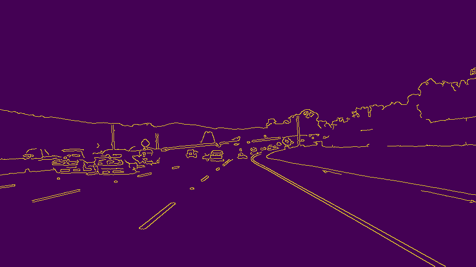

# **Finding Lane Lines on the Road** 

---

**Finding Lane Lines on the Road**

The goals / steps of this project are the following:
* Make a pipeline that finds lane lines on the road
* Reflect on your work in a written report

[//]: # (Image References)

[image1]: ./examples/grayscale.jpg "Grayscale"

---

### Reflection

### 1. Describe your pipeline. As part of the description, explain how you modified the draw_lines() function.

My pipeline consisted of 6 steps:

1. I converted the images to grayscale;

2. I applied a gaussian smoothing filter to suppress noise;

3. I detected the edges by using the canny algorithm;

4. I created a region of interest mask to focus only in the road in front of the vehicle;

5. I run the hough transformation to connect the points and draw lines. The draw_lines function was modified to separate the left and right lines and create two average/extrapolate lines;

6. Finally, I overlaid the original image with the output of step 5 (hough transformation)

### 2. Identify potential shortcomings with your current pipeline

Some possible shortcomings are:

this pipeline does not consider luminosity and colors variation. It probably will fail to detect lane lines whether the image has the presence of shadows, a glare, and a incident light that changes the color of the lane line.

Additionally, it can't detect lane line if there are other cars  in front of the camera .

### 3. Suggest possible improvements to your pipeline

Some possible improvements are take account of color and brightness variation, variation of camera position and angle, and find a way to tune the parameters dynamically depending on the image condition.
